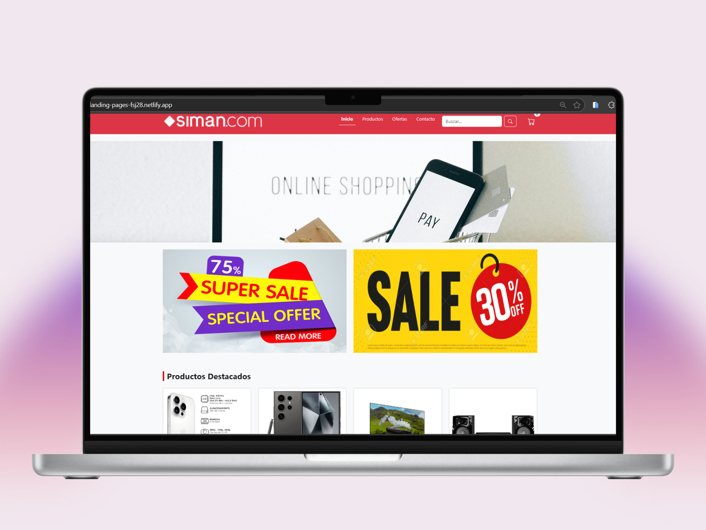
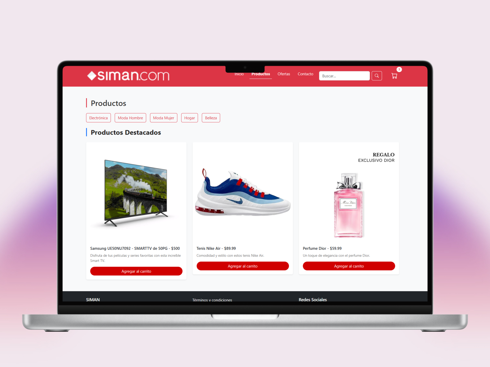
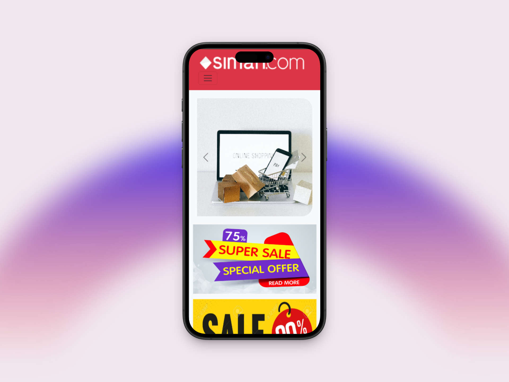
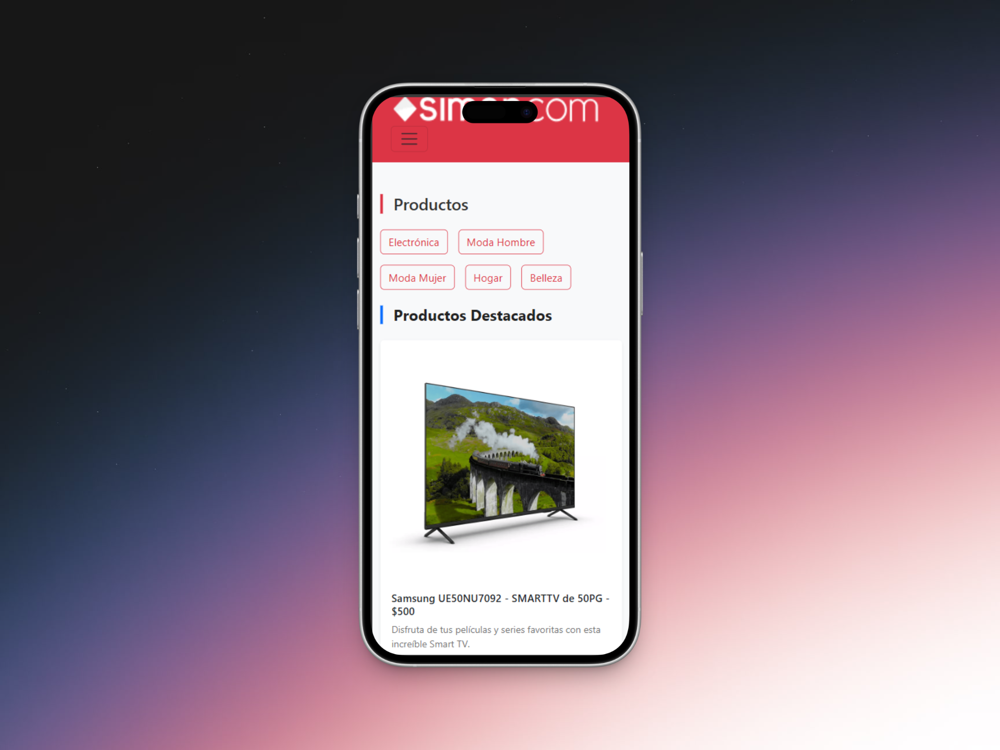

## 🚀 Proyecto: Landing Page Responsiva

Este proyecto consiste en una **landing page estática y moderna**, creada con HTML5 y CSS3. Tiene un diseño limpio, estructura organizada y secciones informativas ideales para representar una marca o empresa que ofrece servicios.

### 🧠 Lo que aprendí:
- Estructuración semántica de una página web con etiquetas como `<header>`, `<main>`, `<section>` y `<footer>`
- Maquetación con **Flexbox** para una distribución flexible de contenido
- Aplicación de estilos CSS personalizados: colores, íconos SVG, tipografía e imágenes
- Implementación de diseño responsivo adaptado a diferentes dispositivos
- Mejora de experiencia visual y jerarquía en el contenido

### 🌐 Enlace al proyecto:
[🔗 Ver sitio en Netlify](https://landing-pages-fsj28.netlify.app/)

### 📸 Captura del proyecto:

  
  

  
  

